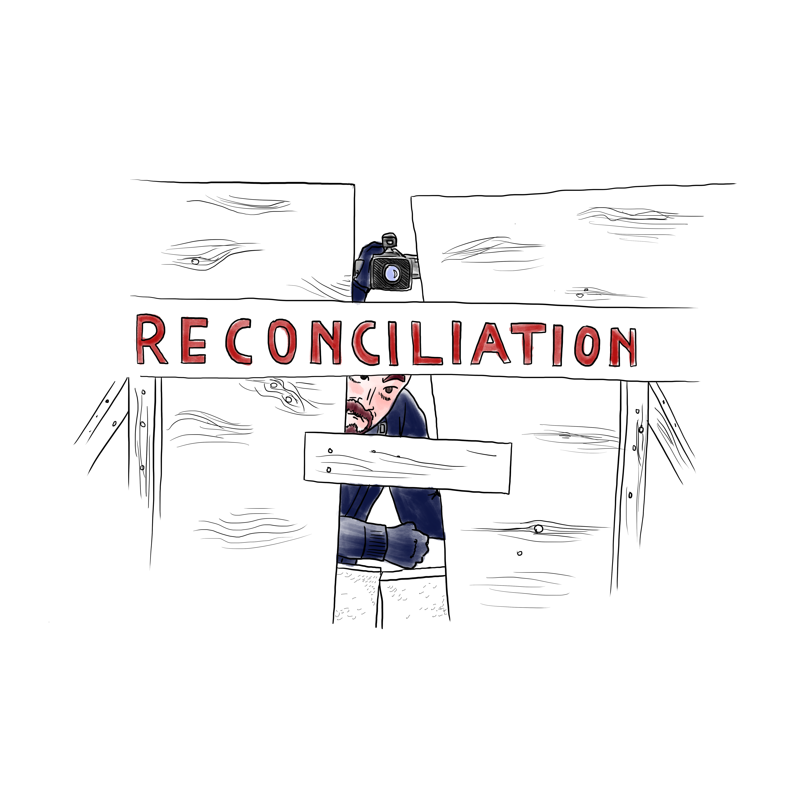
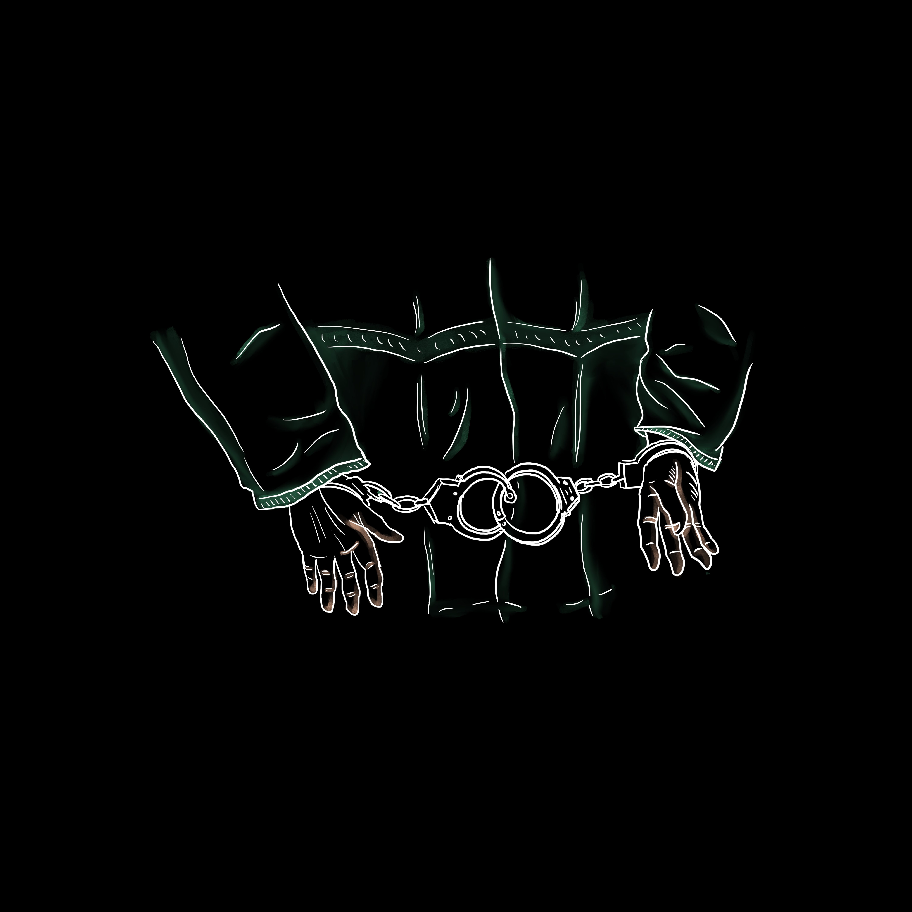

# #WetsuwetenStrong with Karla Tait
Image assets from an illustrated The Red Nation podcast interview with Dr. Karla Tait.

**Feel free to print, change and share!** No commerical use though.

---

## Sources

- The Red Nation Podcast podcast episode: [#WetsuwetenStrong w/ Karla Tait](https://directory.libsyn.com/episode/index/id/13160324/tdest_id/1618577)
- The Red Nation: [Website](https://therednation.org/), [Twitter](https://twitter.com/The_Red_Nation), [Instagram](https://instagram.com/therednationmovement/)
- Illustrated account by Add Oil Comics on [Tumblr](https://addoilcomics.tumblr.com/post/190884413634/the-standoff-between-wetsuweten-land-defenders), [Facebook](https://www.facebook.com/AddOilComics/posts/2549460181941528)

---

## Image assets

The image assets in this repository are licensed under a Creative Commons Attribution-NonCommercial-ShareAlike 4.0 International License. (Just credit `Add Oil Comics`.)

Full-size images are displayed below, so it may take a while to load:

---

## Further information and action

See the Unist'ot'en Camp's [Wet’suwet’en Supporter Toolkit 2020](http://unistoten.camp/supportertoolkit2020/).
